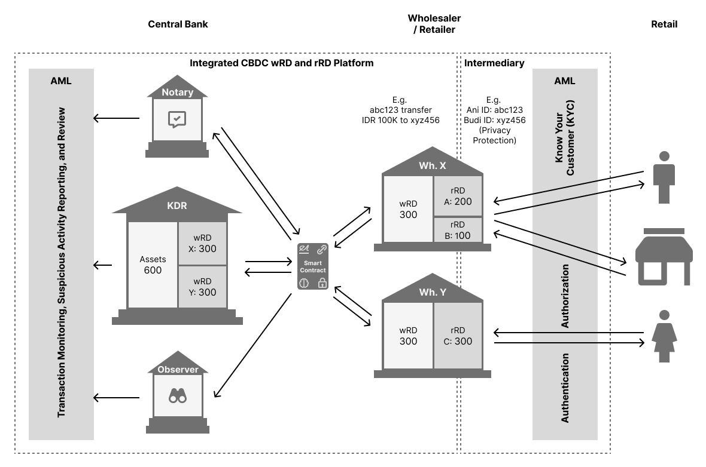
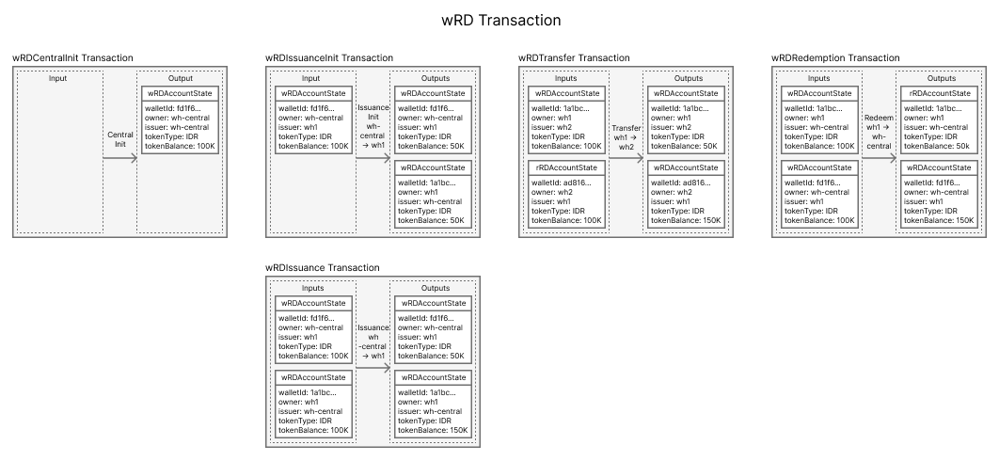
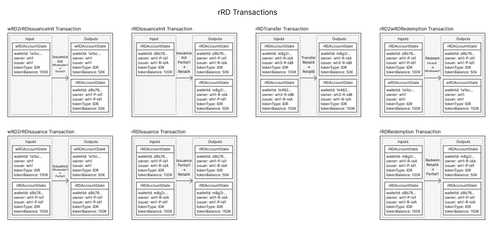
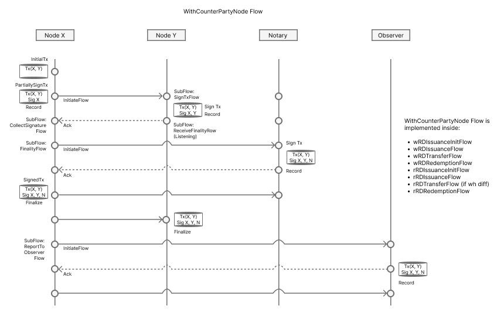
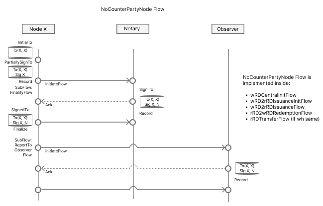
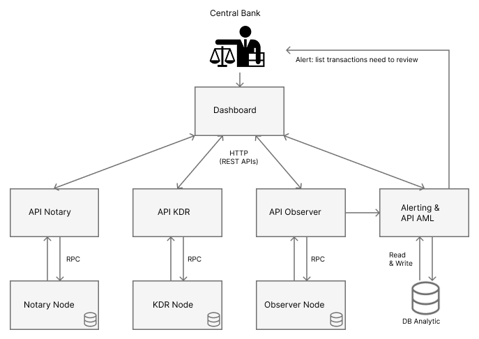

# TRACE: Transaction Review for AML in CBDC Ecosystem
## Introduction
TRACE is a proof-of-concept system designed to demonstrate how Anti-Money Laundering (AML) review can be effectively integrated into a Central Bank Digital Currency (CBDC) ecosystem. This project provides a clear and focused architecture for monitoring, analyzing, and reporting suspicious transactions after they have occurred.

Our approach is inspired by pioneering research from global financial authorities, including the Aurum Project by the Hong Kong Monetary Authority and BIS, the Bank of Japan's CBDC Project, and Bank Indonesia's Project Garuda. We have simplified these complex concepts to build a functional model that concentrates specifically on the critical challenge of post-transaction AML compliance.

## Core Idea: Post-Process AML
In a high-volume CBDC network, performing complex AML checks in real-time can create bottlenecks and slow down the entire system. TRACE is built on the principle of post-process analysis.

Instead of blocking transactions as they happen, the system allows them to clear efficiently on the ledger. A dedicated Observer node records every transaction, which is then fed into a separate analytical engine. This engine identifies suspicious patterns and alerts regulators for review, ensuring the payment system remains fast and resilient while maintaining strong regulatory oversight.

## High-Level Architecture

Our CBDC ecosystem follows an integrated model, with two tiers of digital currency: wholesale (wRD) for interbank settlement and retail (rRD) for public use.

Key Components:

- Central Bank: The root authority. It issues wholesale CBDC (wRD) and oversees the network's core infrastructure.

- Wholesaler (Banks): Financial intermediaries that hold wRD and issue their own retail CBDC (rRD) to the public. They are responsible for KYC and onboarding end-users.

- Retail Users: Individuals and businesses transacting with rRD.

- Notary: A network service that prevents "double-spending" by ensuring each transaction is unique before it is recorded.

- KDR (Khazanah Digital Rupiah): A central registry node that acts as a source of truth for the total amount of assets in circulation.

- Observer: A regulatory node that silently receives a copy of every transaction on the network for compliance and monitoring purposes. This is the primary data source for TRACE.

## Transaction Lifecycle
The system uses a UTXO (Unspent Transaction Output) model, where every transaction consumes existing states (inputs) and produces new ones (outputs). This provides a clear and immutable audit trail.

## Wholesale CBDC (wRD) Transactions

wRD is the foundation of the system, used for settlement between the Central Bank and wholesale institutions.

- CentralInit: The Central Bank creates the initial supply of wRD.

- Issuance: The Central Bank issues wRD to a Wholesaler.

- Transfer: A Wholesaler transfers wRD to another Wholesaler.

- Redemption: A Wholesaler returns wRD to the Central Bank.

## Retail CBDC (rRD) Transactions

rRD is issued by Wholesalers and is backed by their wRD holdings. This is the currency used by the public.

- Issuance: A Wholesaler creates rRD for a retail customer.

- Transfer: A retail user sends rRD to another user.

- Redemption: A retail user redeems rRD, receiving commercial bank money in return.

- wRD2rRD & rRD2wRD: Internal transactions where a Wholesaler converts its wRD holdings into rRD to meet public demand, and vice-versa.

## Technical Transaction Flows
Transactions are managed through distributed ledger technology (DLT) flows. The specific flow depends on the number of parties involved.

### Multi-Party Transactions (WithCounterPartyNode)

This flow is used for transfers between two different participants (e.g., Wholesaler to Wholesaler, User to User). It requires signatures from all involved parties before being notarized and recorded.

### Single-Party Transactions (NoCounterPartyNode)

This simplified flow is used when a single entity transacts with itself (e.g., Central Bank initializing the currency, or a Wholesaler issuing rRD backed by its own wRD). It only requires the initiator's signature.

## The AML Engine: How TRACE Works
The TRACE AML component operates separately from the core transaction ledger to ensure performance is not affected.

Here is the step-by-step process:

1. Data Collection: The Observer Node automatically receives a final, verified copy of every transaction that occurs in the ecosystem.

2. Data Ingestion: The Alerting & API AML service connects to the Observer Node via Remote Procedure Call (RPC). It reads the transaction data and writes it into a dedicated Analytic Database.

3. Pattern Analysis: Pre-defined rules and queries are run against the analytic database to detect suspicious activity. Examples include:

    - Transactions exceeding a specific value threshold.

    - A high frequency of transactions from a single account.

    - Structuring: Multiple small transactions designed to avoid detection.

4. Alert Generation: When a suspicious pattern is identified, the system generates an alert.

5. Regulatory Review: The alert is sent to the Central Bank Dashboard. This provides regulators with a prioritized list of transactions that require human review, along with all the necessary details to conduct an investigation.

## Why This Approach Wins
- Focus and Feasibility: By concentrating on a single, critical function (post-process AML), this project demonstrates a complete and working solution that is highly relevant and achievable within a hackathon timeframe.

- Clarity and Separation of Concerns: The architecture cleanly separates the high-speed transaction processing layer from the resource-intensive analytical layer. This is a robust design for a real-world system.

- Real-World Relevance: AML is a non-negotiable requirement for any CBDC. This project directly addresses this need with a practical solution.

- Strong Foundation: Basing the model on principles from leading central bank research projects demonstrates a deep understanding of the problem domain and adds credibility to the solution.

References
- [BIS Project Aurum](https://www.bis.org/publ/othp57.htm)
- [Bank of Japan CBDC Proof-of-Concept](https://www.boj.or.jp/en/paym/digital/dig250718a.pdf)
- [Bank Indonesia Project Garuda](https://www.bi.go.id/id/rupiah/digital-rupiah/default.aspx)
